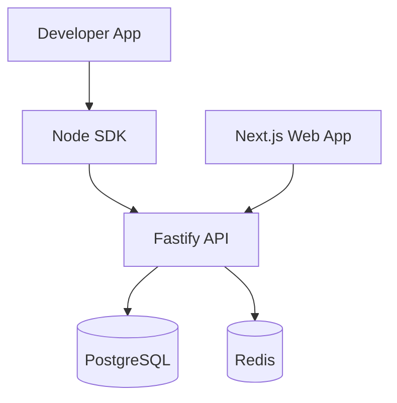

# Feature Flag Platform (LaunchDarkly Alternative)

This project aims to build a robust, scalable, and developer-friendly feature flag platform. It includes a dashboard for managing flags, an API for serving them, and a Node.js SDK for easy integration.

## User Review Required

> [!IMPORTANT]
> The project will use a monorepo structure with `pnpm workspaces`. Ensure `pnpm` is installed on your system.

> [!NOTE]
> We will use `Better Auth` for authentication as it is highly customizable and works well with this stack. If you prefer `Clerk`, please let me know.

## Proposed Architecture

## User Review Required

> [!IMPORTANT]
> **API Key System**: Users will have unique API keys generated for each **Environment** (Development, Staging, Production). These keys are used by the SDK to fetch flag configurations. We can also implement **Admin API Keys** for programmatic management of flags if needed.

## Proposed Changes

### [Phase 1] Foundation & Monorepo Setup

We will initialize a monorepo using `pnpm workspaces`.

#### [NEW] [package.json](file:///c:/Users/G-LIGHT/Desktop/Open Source/Feature Flag Platform (LaunchDarkly Alternative)/package.json)
- Define workspaces for `apps/*` and `packages/*`.
- Root scripts for development and building.

#### [NEW] [pnpm-workspace.yaml](file:///c:/Users/G-LIGHT/Desktop/Open Source/Feature Flag Platform (LaunchDarkly Alternative)/pnpm-workspace.yaml)
- Define workspace structure.

### [Phase 2] Shared Package & Database

Create a shared package for common types, validation schemas (Zod), and the core hashing logic.

#### [NEW] [packages/shared](file:///c:/Users/G-LIGHT/Desktop/Open Source/Feature Flag Platform (LaunchDarkly Alternative)/packages/shared)
- Core types for Flags, Projects, and Environments.
- Deterministic hashing function for rollouts.

#### [NEW] [apps/api/prisma/schema.prisma](file:///c:/Users/G-LIGHT/Desktop/Open Source/Feature Flag Platform (LaunchDarkly Alternative)/apps/api/prisma/schema.prisma)
- Define the database schema as outlined in the requirements.

### [Phase 3] API Server (Fastify)

A high-performance API server to handle dashboard requests and SDK flag fetching.

#### [NEW] [apps/api/src/server.ts](file:///c:/Users/G-LIGHT/Desktop/Open Source/Feature Flag Platform (LaunchDarkly Alternative)/apps/api/src/server.ts)
- Fastify server initialization.
- Prisma integration.
- Routes for Projects, Environments, and Flags.
- SDK-specific endpoint `/sdk/flags`.

### [Phase 4] Next.js Web App

A modern web application for developers to manage their flags.

#### [NEW] [apps/web](file:///c:/Users/G-LIGHT/Desktop/Open Source/Feature Flag Platform (LaunchDarkly Alternative)/apps/web)
- Next.js 14 (App Router).
- Tailwind CSS & shadcn/ui.
- TanStack Query for data fetching.
- Authentication integration.

### [Phase 5] Node SDK

A lightweight, caching-enabled SDK for Node.js applications.

#### [NEW] [packages/sdk-node](file:///c:/Users/G-LIGHT/Desktop/Open Source/Feature Flag Platform (LaunchDarkly Alternative)/packages/sdk-node)
- `FlagsClient` class.
- Local caching with background refresh.
- Deterministic rollout evaluation.

## Verification Plan

### Automated Tests
- **Unit Tests**: Test the hashing logic in `@yourorg/shared`.
- **Integration Tests**: Test the SDK flag fetching and evaluation against a running API.
- **API Tests**: Use `Supertest` to verify CRUD operations for flags and projects.

### Manual Verification
- Create a project and environment in the dashboard.
- Create a flag with 50% rollout.
- Use the SDK to verify that the same `userId` always gets the same result.
- Toggle the flag and observe instant (or cached) updates.
